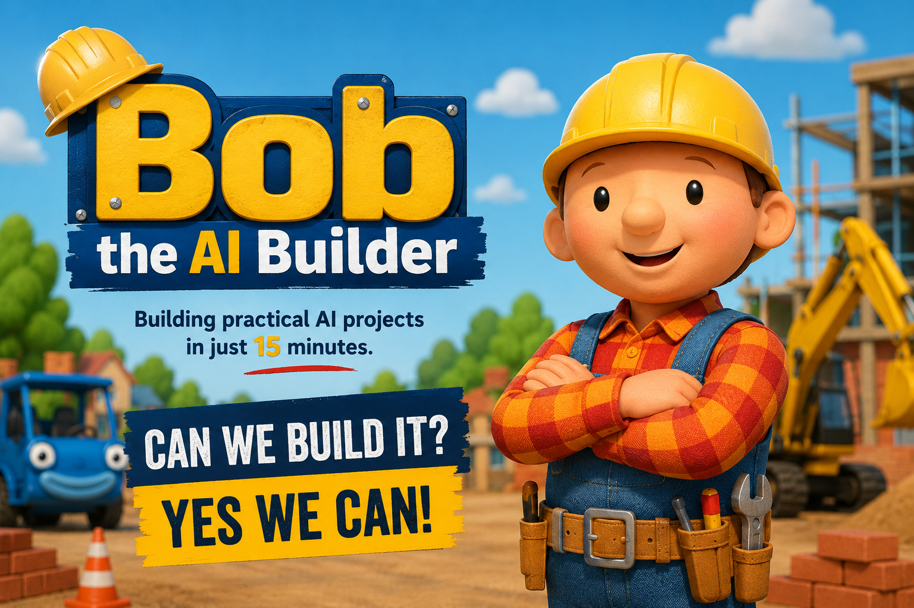

# 🤖 Bob the AI Builder

*"Can we build it? Yes, we AI!"*
<p>
  
</p>
## About

**Bob the AI Builder** is a weekly learning series focused on building practical AI projects in just **15 minutes**.

The inspiration comes from the childhood cartoon **Bob the Builder**, where every episode ended with something new being built. This series follows the same philosophy—every session is about creating a working AI application from scratch.

The objective isn't to become AI experts overnight or dive deep into complex theory. Instead, it's about taking small, practical steps that help everyone get comfortable building with modern AI tools.

Think of it as **getting your feet wet**. Every project is intentionally small enough to complete during a short session while demonstrating the real capabilities of today's AI ecosystem.

Whether you're completely new to AI or have already experimented with it, the goal is to leave every session having learned something new and built something tangible.

---

## 🎯 Goals

- Learn AI by building instead of just watching
- Create a complete working project in under 15 minutes
- Explore modern AI APIs and SDKs
- Discover how AI can simplify everyday development tasks
- Encourage experimentation and curiosity
- Have fun while building!

---

## 🛠️ Tech Stack

Projects may use one or more of the following technologies:

- Python
- Streamlit
- OpenAI SDK
- Git & GitHub
- REST APIs
- LangChain (future sessions)
- Vector Databases (future sessions)
- MCP (future sessions)
- AI Agents (future sessions)
- Other AI tools and frameworks

---

# 📚 Session Library

This section will grow over time as new sessions are added.

| Session | Project | Description |
|---------|----------|-------------|
| 01 | AI Resume Analyzer | Upload a resume and compare it against a job description using the OpenAI API. Receive AI-generated feedback on strengths, weaknesses, skill gaps, and suggestions for improvement. Built with Python, Streamlit, and the OpenAI SDK. |

---

## 🚀 Running a Project

```bash
git clone <repository-url>
cd <project-folder>

python -m venv .venv

source .venv/bin/activate
# Windows
# .venv\Scripts\activate

pip install -r requirements.txt

streamlit run app.py
```

---

## 💡 Why this repository?

This repository serves as the codebase for every **Bob the AI Builder** session.

Instead of creating isolated demos, all projects live in one place, making it easy to revisit previous sessions, learn from past examples, and continue experimenting beyond the live demonstrations.

Each new session adds another practical AI project to the collection.

---

## 📅 Coming Soon

Some ideas for future sessions include:

- AI Meeting Notes Summarizer
- Resume vs Job Matcher
- AI Email Generator
- SQL Query Generator
- Code Reviewer
- Documentation Generator
- PDF Chat Assistant
- Image Caption Generator
- Voice-to-Notes
- AI Test Case Generator
- Git Commit Message Generator
- AI-powered Log Analyzer

---

Happy Building! 🚀